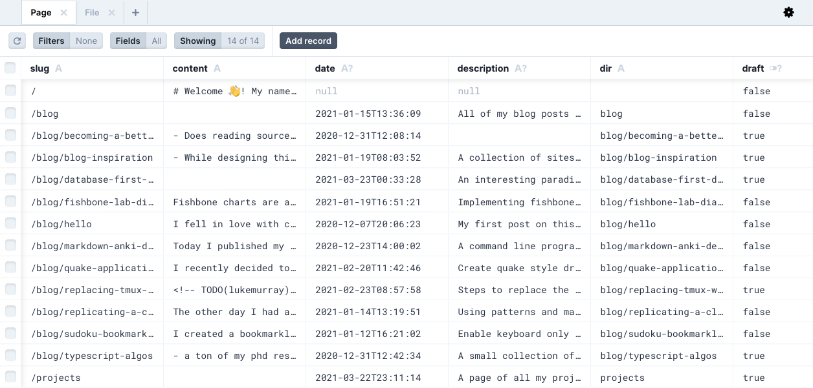
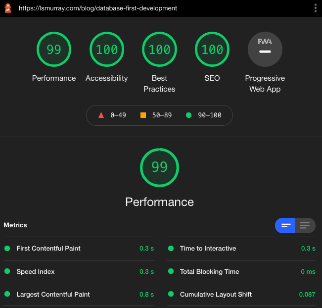

This site is an exercise in database first development for blogging.
All of the pages in the site are parsed and stored in a sqlite database.
The site is then statically generated by querying the database using graphql.

## Why would you build a site like this?

I love to organize my thoughts in nested hierarchies and clusters [^prefertags]. Some people are _definitely not obsessed with hierarchies, categories, tags, and clusters_ [^preferlinear], but if you are then you may have been frustrated with some of the JAMStack[^jamstack] frameworks that have become popular recently.

[^prefertags]: [SimonWillison's Weblog](https://simonwillison.net/) is a good example of an extremely hierarchical and clustered site.
[^preferlinear]: Notably [Jess Fraz's Blog](https://blog.jessfraz.com/) which is amazing but is simply a list!
[^jamstack]: JAMstack stands for [Javascript, Apis, and Markup](https://jamstack.wtf/#meaning). The idea is that you handle dynamic rendering with javascript, query your data with APIs, and write your content with markup.

If you every tried building nested sections and page hierarchy in [Gatsby](http://gatsbyjs.com/) or [Next.js](http://nextjs.com) you'll know what I mean. Both the [default gatsby starter](https://github.com/gatsbyjs/gatsby-starter-blog) and the [default next starter](https://github.com/vercel/next.js/tree/canary/examples/blog-starter) have a single folder of posts. If you want to add sections or page organization based on the file system you need to _write your own api_ which is easier said than done. Essentially you have Javascript and Markup but no API for your content.

Previous static site generators exist on the opposite side of the spectrum, thy have rich content APIs but no javascript.
Hugo's API supports content organization with nested sections, leaves, categories, and tags out of the box. Unfortunately Hugo's API is quite difficult to use in practice. Even though Hugo's API is simple, Hugo pages are customized with a [weird template language](https://gohugo.io/templates/introduction/) which uses hard to read prefix expressions.

Database first development brings the rich content organization of frameworks like Hugo into the new and fun react static blogging ecosystem. The result is a very performant, clean, and intuitive API over your content which you can use to make beautiful web experiences.

If we want to get the parent of the current we simply access the `currentPage.parent`. If we want to get all the child pages we can access `currentPage.pages`. Any relationship we encode in the database is just a query away. We could go even further, parse the markdown AST while creating the database, and encode a table of `Link`s with `target` and `source` pages. The link table would enable a trivial implementation for rendering backlinks and references. We could even use this table to find broken links in our site. Treating the database as a source of truth is powerful ✨.

## Why wouldn't you build a site like this?

All this power does not come for free.
Sure I could simply put my posts in a database and call it a day, but instead I use

- [prisma](https://www.prisma.io/) to create a sql schema
- [typegraphql-prisma](https://github.com/MichalLytek/typegraphql-prisma#readme) to create a graphql schema
- [apollo-server](https://www.apollographql.com/docs/apollo-server/) to serve a graphql api endpoint
- [graphql-code-generator](https://www.graphql-code-generator.com/) to generate typescript types from graphql queries
- [Next.js](https://nextjs.org/) to statically generate all my pages from this for a static site.

All of these dependencies could break and I'm sure they would be annoying to fix. But hey _we're having fun... right?_ In addition, I would never bring any of this to a production site. As soon as you need to query at runtime the automatically generated apis and type safety lead to a bunch of performance issues. Luckily with a blog all my assets are statically generated so the performance issues are not a problem[^lighthouse].

[^lighthouse]:
    Check it out 😉, but [don't get too excited](https://www.matuzo.at/blog/building-the-most-inaccessible-site-possible-with-a-perfect-lighthouse-score/).

    

---

If you have ideas about what you would like to do or see in a database first blog, let me know on twitter [@lukesmurray](https://twitter.com/@lukesmurray).
