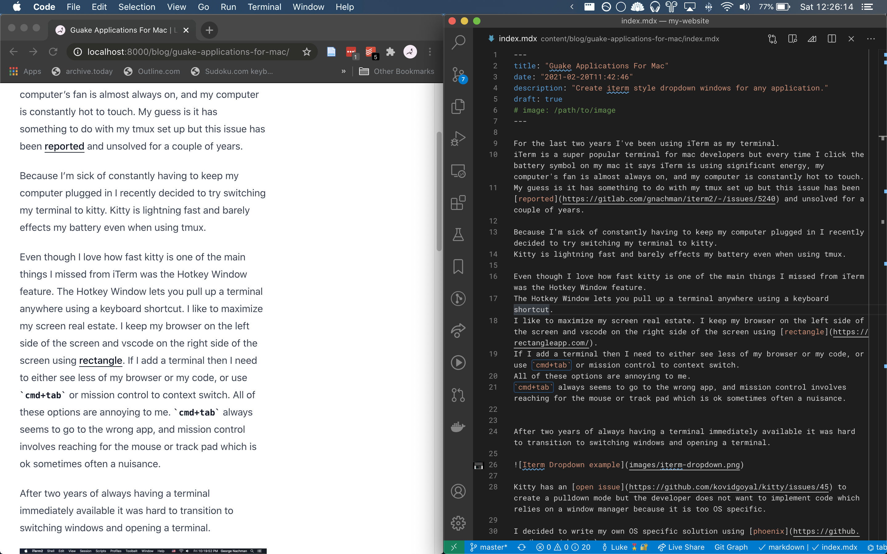
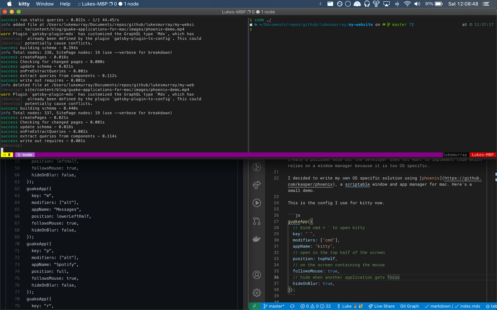

I recently decided to replace [iTerm](https://iterm2.com/) on my mac with [Kitty](https://sw.kovidgoyal.net/kitty/).
iTerm is a [super popular terminal](https://www.slant.co/topics/525/~best-terminal-emulators-for-mac) but it [uses a ton of CPU and power](https://gitlab.com/gnachman/iterm2/-/issues/5240).
If I have iTerm open when I’m traveling I have to keep my computer plugged in or I’ll burn through my battery in 2-3 hours.

Kitty is lightning fast and much more energy efficient.
But Kitty provides a less polished experience out of the box than iTerm2.
One of the main things I missed from iTerm was the [quake inspired](http://freesoftwaremagazine.com/articles/how_to_use_quake-style_terminals_on_GNU_Linux/) Hotkey Window feature.

The Hotkey Window lets you pull up a terminal anywhere using a keyboard shortcut.
Why would you want to do this?
The [Guake Project](http://guake-project.org/) (a quake style terminal for Gnome) explains very well. 

> Imagine you are working in your favorite text editor and want to execute some commands, like execute the unit test of your code, check a man page, or edit some configuration file. You can do it at lightning speed without leaving your keyboard. Just press your predefined \[...\] hotkey, execute your command, and repress it to hide the terminal and go back to your work.

I also use quake style terminals to have more screen real estate on my laptop.
I use [rectangle](https://rectangleapp.com/) to keep my browser maximized on the left side of the screen and vscode maximized on the right side of the screen.




If I want to see my terminal I need to either make my browser or code window smaller.
I could use `cmd+tab` or the mouse to switch to my terminal but these options are annoying.
`cmd+tab` always seems to go to the wrong app, and mission control involves reaching for the mouse or track pad which is often a nuisance.

Kitty has an [open issue](https://github.com/kovidgoyal/kitty/issues/45) to create a quake style mode but the developer does not want to implement code which relies on a window manager because it is too OS specific.

At this point I felt like I would have to choose between having a fast terminal with no quake feature, or accept that I love quake style drop downs so much that I’m ok with my computer constantly running out of battery.

Then I stumbled upon [phoenix](https://github.com/kasper/phoenix), a tool which lets you write javascript code which hooks into the macOS window manager.
I decided to try and write my own script to emulate a quake style drop down for kitty.
Originally I just wanted to use a shortcut to make Kitty show up on the top half of my screen.
But after a bit of hacking I've been able to emulate all of the features of the iTerm2 hotkey.
In addition my script lets me emulate iTerm's Hotkey Window feature for any application.

This is all the code I need to implement an iTerm style window for kitty.

```js
guakeApp({
  // bind cmd + ` to open kitty
  key: "`",
  modifiers: ["cmd"],
  appName: "kitty",
  // open in the top half of the screen
  position: topHalf,
  // on the screen containing the mouse
  followsMouse: true,
  // hide when another application gets focus
  hideOnBlur: true,
});
```

And here is a screenshot of the code in action.



I now use keyboard shortcuts to pull up Messages, Slack, Spotify, and other applications which usually require a context switch to view.

If you want to try it yourself. You'll need to

1. Install Phoenix `brew install --cask phoenix`
2. Copy my [phoenix config](https://github.com/lukesmurray/bootstrap/blob/fd621400cd2ec8cff6b06c0b883f191ecdb42197/.config/yadm/alt/.phoenix.js%23%23default) to `~/.phoenix.js`
3. Try pressing cmd+\` to open kitty, `alt+s` to open slack, `alt+m` to open messages, or `alt+p` to open spotify.

If you want to customize the config just modify the [`guakeApp` calls](https://github.com/lukesmurray/bootstrap/blob/fd621400cd2ec8cff6b06c0b883f191ecdb42197/.config/yadm/alt/.phoenix.js%23%23default#L46-L93).