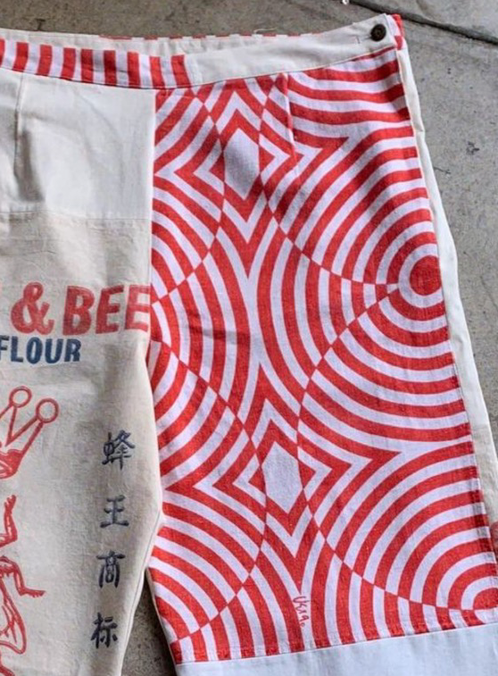
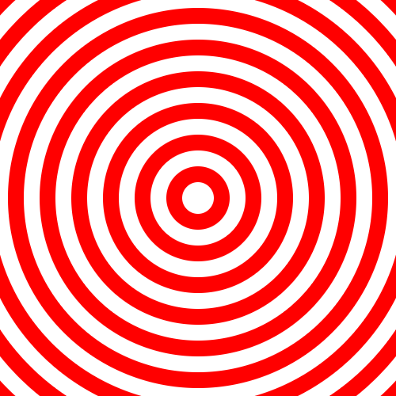
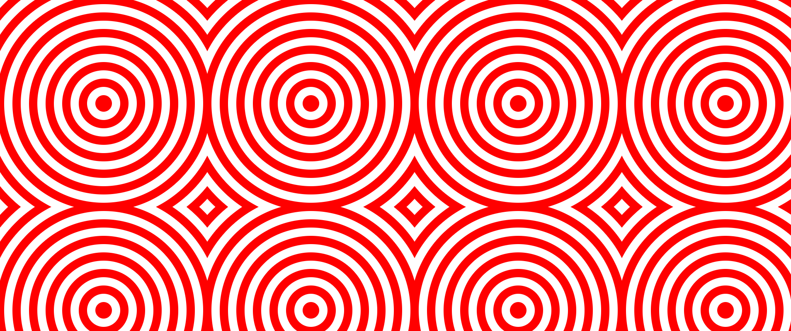
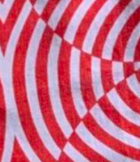
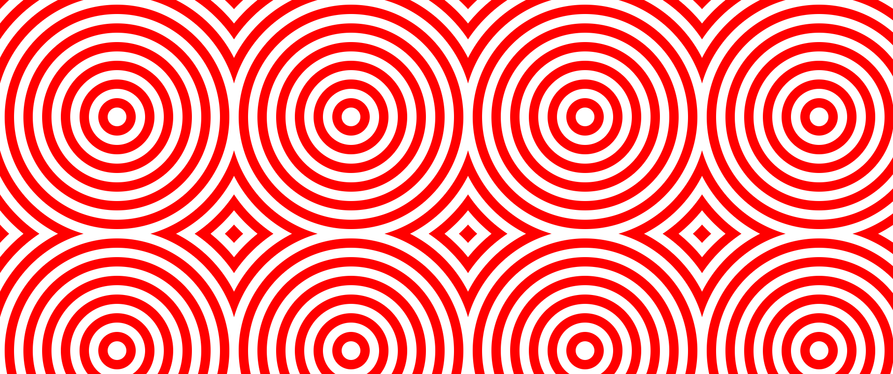
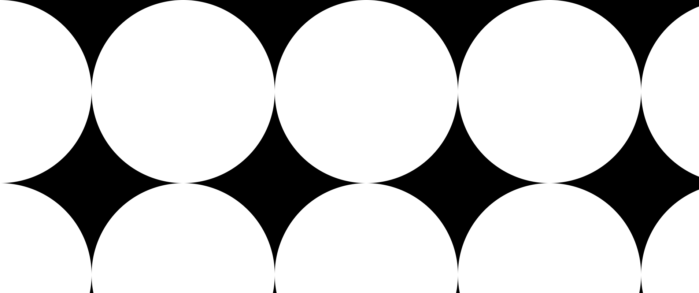
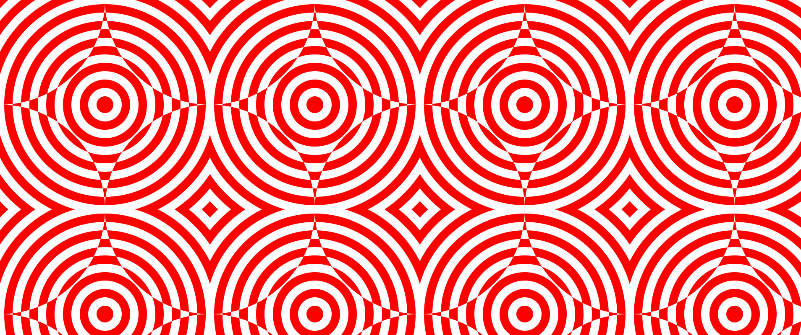
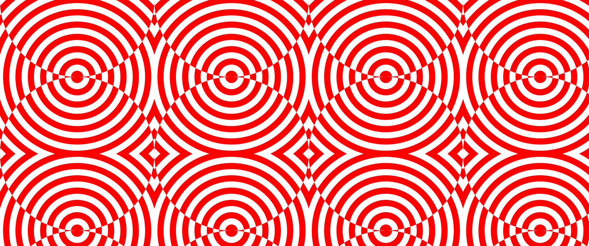

The other day I had a ton of fun replicating a design found on this pair of jeans.



I wanted to document some of the design process of translating a design from the real world into code.
All of the code is written on [observablehq](http://observablehq/@lukesmurray/svg-spirals) and it makes use of some features specific to observable, mostly the [svg literal](https://github.com/observablehq/stdlib#svg).

## Design Process

I knew svg's would be a good place to start for replicating the design.
The design consists of simple shapes and svgs are great at drawing simple shapes.

The first step was to create a series of circles in a bullseye pattern.
The design is essentially a repeating grid of bullseye patterns cut out into a square.
The simplest way to create this type of cut out bullseye is to use the svg itself as the boundaries of the square and then stack circles on top of each other to create the rings.
The circles all increment by the same amount so we can map a javascript array to a list of [svg `circle` elements](https://developer.mozilla.org/en-US/docs/Web/SVG/Element/circle).

```js
{
  // width of a stroke
  const circleSize = 10;
  // size of the pattern
  const size = 100;
  const center = size / 2;
  // number of circles to draw
  const numCircles = Math.ceil(size / circleSize);
  return svg`<svg width="${width}" height="${height}">
  ${Array(numCircles)
    .map(
      (_, i) =>
        svg`<circle cx="${center}" cy="${center}" r="${circleSize * i}" fill="${
          i % 2 === 0 ? "red": "white
        }"/>`
    )
    .reverse() /* reverse the array so the smallest circle is on the top */ }
</svg>`;
}
```



That already looks good.
The next step is to try and repeat the bullseye across the svg.
We could write a bunch of code to repeat [svg `rect` elements](https://developer.mozilla.org/en-US/docs/Web/SVG/Element/rect) elements across the svg.
But we might have a bug in our code, and its easier to let the browser take care of the repetition.

- Writing declarative code is usually easier than writing imperative code.

The trick is to use an [svg `pattern` element](https://developer.mozilla.org/en-US/docs/Web/SVG/Element/pattern).
We draw our bullseye in the pattern, then we use the pattern as the fill on full size rect.
The effect is our bullseye is repeated across the entire svg.

```js
{
  // width of a stroke
  const circleSize = 10;
  // size of the pattern
  const size = 100;
  const center = size / 2;
  // number of circles to draw
  const numCircles = Math.ceil(size / circleSize);
  return svg`<svg width="${width}" height="${height}">
  <defs>
    <pattern id="circles" x="0" y="0" width="${size}" height="${size}" patternUnits="userSpaceOnUse">
  ${Array(numCircles)
    .map(
      (_, i) =>
        svg`<circle cx="${center}" cy="${center}" r="${circleSize * i}" fill="${
          i % 2 === 0 ? "red" : "white"
        }"/>`
    )
    .reverse()}
    </pattern>
  </defs>
  <rect fill="url(#circles)" width="${width}" height="${height}"/>
</svg>`;
}
```



This is already pretty good but if we look closely at the design on the jeans we can see the circles switch colors at certain points.



In order to create the alternating colors we'll want to overlay two rectangles on top of each other.
The bottom rectangle will have `red, white` circles.
The top rectangle will have `white, red` circles.
We'll need to cut out pieces of the top rectangle so we can see the bottom rectangle.
We'll explain cutting out in a second.
But first lets draw the bullseye from before with swapped colors.

It's actually very easy we just need to swap the ordering of the color in our fill.

```js {diff}
{
  ${Array(numCircles)
    .map(
      (_, i) =>
        svg`<circle cx="${center}" cy="${center}" r="${circleSize * i}" fill="${
-          i % 2 === 0 ? "red": "white"
+          i % 2 === 0 ? "white": "red"
        }"/>`
    )
    .reverse()}
```



Now we have the basic building blocks of our visualization but we want to overlay the two visualizations on top of one another with circular cut outs.
In order to create the cutouts we'll use an [svg `mask` elements](https://developer.mozilla.org/en-US/docs/Web/SVG/Element/mask).

A mask can be used to make parts of an svg element transparent.
The black parts of the mask are completely rendered and the white parts of the mask are completely blocked out.

- We could try to use an [svg `clipPath` element](https://developer.mozilla.org/en-US/docs/Web/SVG/Element/clipPath) to do our masking but clipPath elements do not support patterns and patterns make writing our code much easier

The trick to creating the mask is to overlay two rectangles.
The first rectangle is `white` which means we render everything.
The second rectangle is rendered with a pattern of `black` circles which are the same size as our bullseye.
The part in the circle will be hidden and the part outside the circle will be rendered.

```js
{
  // size of the pattern
  const size = 100;
  const center = size / 2;
  // number of circles to draw
  const numCircles = Math.ceil(size / circleSize);
  return svg`<svg width="${width}" height="${height}">
<defs>
    <pattern id="outlineMaskCircles" x="${
      size / 2
    }" y="0" width="${size}" height="${size}" patternUnits="userSpaceOnUse">
<circle cx="${center}" cy="${center}" r="${size / 2}" fill="black"/>
    </pattern>
 <mask id="outlineMask">
    <rect x="0" y="0" width="${width}" height="${height}" fill="white" />
    <rect x="0" y="0" width="${width}" height="${height}" fill="url(#outlineMaskCircles)" />
  </mask>
</defs>


  <rect fill="black" rx="0" ry="0" width="${width}" height="${height}" mask="url(#outlineMask)" />
</svg>`;
}
```



Now that we have all the individual components we can bring them together and compare them to the original design.

```js
{
  const size = 100;
  const center = size / 2;
  const numCircles = Math.ceil(size / circleSize);
  return svg`<svg width="${width}" height="${height}">
<defs>
    <pattern id="cutoutMaskCircles" x=${0} y="${0}" width="${size}" height="${size}" patternUnits="userSpaceOnUse">
<circle cx="${center}" cy="${center}" r="${size / 2}" fill="black"/>
    </pattern>
 <mask id="cutoutMask"> 
    <rect x="0" y="0" width="${width}" height="${height}" fill="white" />
    <rect x="0" y="0" width="${width}" height="${height}" fill="url(#cutoutMaskCircles)" />
  </mask>

    <pattern id="cutoutPattern" x="0" y="0" width="${squareSize}" height="${squareSize}" patternUnits="userSpaceOnUse">
  ${Array(numCircles)
    .map(
      (v, i) =>
        svg`<circle cx="${center}" cy="${center}" r="${circleSize * i}" fill="${
          i % 2 === 0 ? color2 : color1
        }"/>`
    )
    .reverse()}
    </pattern>
    <pattern id="circlePattern" x="0" y="0" width="${squareSize}" height="${squareSize}" patternUnits="userSpaceOnUse">
  ${Array(numCircles)
    .map(
      (v, i) =>
        svg`<circle cx="${center}" cy="${center}" r="${circleSize * i}" fill="${
          i % 2 === 0 ? color1 : color2
        }"/>`
    )
    .reverse()}
    </pattern>

</defs>
  <rect fill="url(#circlePattern)" rx="0" ry="0" width="${width}" height="${height}" />
  <rect fill="url(#cutoutPattern)" rx="0" ry="0" width="${width}" height="${height}" mask="url(#cutoutMask)" />
</svg>`;
}
```



In my first attempt I got this interesting visualization but it isn't quite right.
The alternating colors need to be offset from the centers.
There are probably multiple ways of offsetting the alternating colors but I chose to move the mask vertically by half a square size.

```js {diff}
{
-    <pattern id="cutoutMaskCircles" x=${0} y="${0}" width="${size}" height="${size}" patternUnits="userSpaceOnUse">
+    <pattern id="cutoutMaskCircles" x=${0} y="${size / 2}" width="${size}" height="${size}" patternUnits="userSpaceOnUse">
```



At this point we've pretty much replicated the pattern from the jeans.
For some final tricks I used ellipses to render the mask instead of circles in order to create a nice gap in the pattern.
I also parameterized the radius of the inner most circle of the bullseye which is fun to control.
I've embedded the final visualization below and you can also [play with it and see all of the code on observablehq](https://observablehq.com/@lukesmurray/svg-spirals).

## Visualization

<iframe
  width="100%"
  height="885"
  frameBorder="0"
  title="Svg Spirals"
  src="https://observablehq.com/embed/@lukesmurray/svg-spirals?cell=circles&cell=viewof+squareSize&cell=viewof+circleSize&cell=viewof+innerCircleSize&cell=viewof+gap&cell=viewof+color1&cell=viewof+color2"
></iframe>
