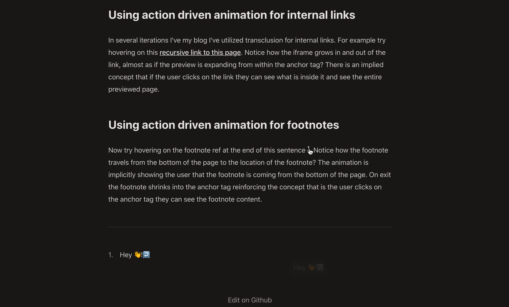

I recently came across Tobias Ahlin's post [Meaningful motion with action-driven animation](https://tobiasahlin.com/blog/meaningful-motion-w-action-driven-animation/).
The post captures one of those ideas which is so simple that it seems obvious in hindsight. _Animations are much more useful when they reflect the action the user took._

## What is action driven animation

What does this mean? [Tobias explains better than I ever could](https://tobiasahlin.com/blog/meaningful-motion-w-action-driven-animation/) but I'll do my best. Take a simple case. We are displaying an alert to the user. The user can either accept or cancel the alert. If we use state driven animation then the alert can be in two states, visible or not visible. When the alert is visible we _fade it in_ and when the alert is not visible we _fade it out_. Another way to animate the alert is by applying action driven animation. In the action driven paradigm we use the animation to indicate which action the user took. When the user accepts the alert we fade the alert out while animating it towards the user on the z-axis. When the user rejects the alert we fade it out while animating it away from the user on the z-axis. If that doesn't make sense I _highly recommend_ checking out the first two visual examples in [Meaningful motion with action-driven animation](https://tobiasahlin.com/blog/meaningful-motion-w-action-driven-animation/). Action driven animation simply feels intuitive. It adds that extra bit of _juice_ [^juice].

[^juice]: _Juice_ is a popular term used in game design to describe the intangible feelings and sensations people have when playing video games. [Juice it or lose it](https://www.youtube.com/watch?v=Fy0aCDmgnxg) is a great example for seeing how much an experience can be transformed with the addition of some _juice_.

## Using action driven animation for internal links

<aside style={{border: "2px solid var(--text-secondary-light)", padding: "0 2rem"}}>

**⚠️ Touch Screen and Mobile Users**

The hover examples below do not work on touch devices! If you're reading this on a touch device you'll have to make do with the gifs! Tapping the links will not cause an animation to occur.

</aside>

I've added transclusion for internal links in several iterations of my blog. For example try hovering on this [[index.mdx|recursive link to this page]]. Notice how the iframe grows in and out of the link, almost as if the preview is expanding from within the anchor tag? The animation is indicating to the user that the page is coming from _inside the link_. Implicitly the animation is reinforcing the concept that if the user clicks on the link they will navigate to the previewed page.

## Using action driven animation for footnotes

Now try hovering on the footnote ref at the end of this sentence [^example-footnote]. Notice how the footnote travels from the bottom of the page to the location of the footnote? The animation is implicitly showing the user that the footnote is coming from the bottom of the page. On exit the footnote shrinks into the anchor tag reinforcing the concept that if the user clicks on the anchor tag they will navigate to the footnote content.

[^example-footnote]: Hey 👋!

## Applying the technique

These examples are incredibly trivial but they add just a tiny bit of extra detail to the page, making the user experience that much more enjoyable.

I am definitely not a designer, but I love reading about design and this is one of the few techniques I've come across which immediately made me think, _if I learn how to apply this I can spark joy in people_ [^otherexamples]. I love the notion of thinking about UI design as a process of story telling and animation is one of the most powerful tools we have available for telling that story. Tobias does a better job than I ever could of explaining how action driven animation can be used not just to make the user interfaces more intuitive, but even to teach the user how to use an application.

Although I rarely have time to add this much design detail to my research prototypes, if I ever do find some extra time, action driven animation is definitely going to be one of the first details I focus on.

[^otherexamples]: Another example is the use of light to create depth in [Refactoring UI](https://refactoringui.com/book/) by Adam Wathan and Steve Schoger.
