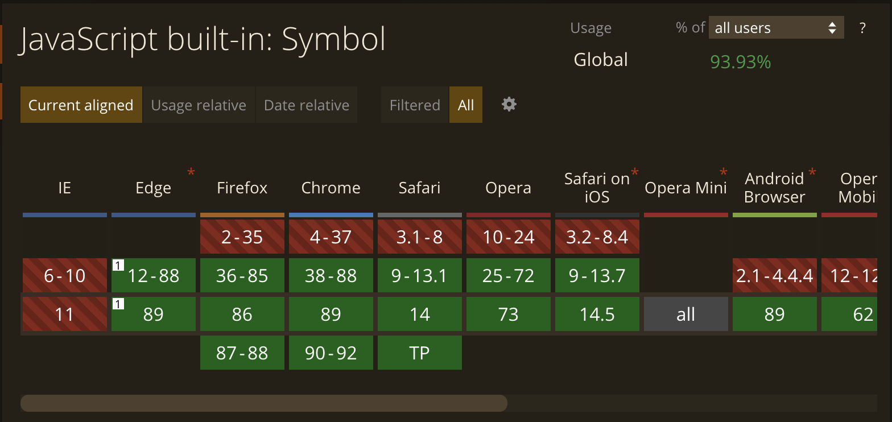

One of the projects I'm working on has to support Internet Explorer 11 (IE11).
The project also relies on an autocomplete system built using [compressed tries](https://en.wikipedia.org/wiki/Trie#Compressing_tries).
All of the details of the trie implementation are beyond the scope of this post, but I need to reveal some of the details to explain the issues I ran into when trying to get the trie to work in IE11.

The trie is a [hash trie](https://en.wikipedia.org/wiki/Hash_trie) which uses javascript objects as nodes and javascript object properties as prefixes which point to child nodes.
Relying on objects and properties keeps the implementation super simple but it makes it hard to add metadata to trie nodes. For example if I want to have a property which points to a trie node's parent I can't use the `parent` property since that could be a prefix which points to a child. Instead I use [javascript symbols](https://developer.mozilla.org/en-US/docs/Web/JavaScript/Reference/Global_Objects/Symbol) to point to datastructure properties.

Symbols have the nice benefit that they do not show up in [`for...in`](https://developer.mozilla.org/en-US/docs/Web/JavaScript/Reference/Statements/for...in) loops.
This simple fact made the code for traversing my trie very literate. I could iterate over prefixes in my trie using `for (const prefix in node)` [^hindsight].

[^hindsight]: In hindsight symbols just overcomplicated my implementation but at the time it felt like a reasonable decision.

Unfortunately symbols are not supported by IE11.

When getting the trie to work on IE11 I imported a [corejs symbol polyfill](https://github.com/zloirock/core-js#ecmascript-symbol) and called it a day. But my datastructure completely broke.

I'm not sure if this is a common experience but this was the first time where I used a polyfill and the behavior was significantly different to the point that I had to change my code.
There were really only three issues I ran into but they were enough to require a bunch of changes in my implementation.

- The polyfilled symbols do show up in `for...in` loops.
- `typeof Symbol()` does not equal `symbol`, it equals `object`
- `Symbol() in Object` does not work, normally you can check to see if a property is set with this syntax but with the polyfill this statement always returns true.

All of these [symbol issues are documented in the corejs readme](https://github.com/zloirock/core-js#caveats-when-using-symbol-polyfill) but this was the first time I ever realized there were caveats to be aware of.
